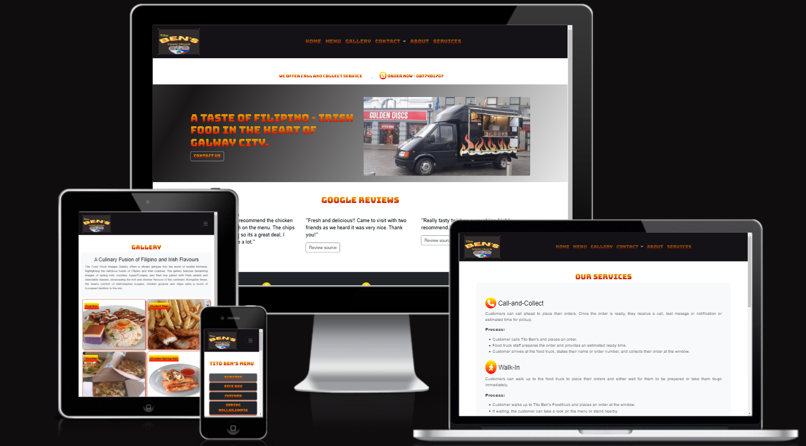

# Tito Ben's Food Truck

This website is created to increase the visibility of Tito Ben's Food truck business in the heart of Galway City. Currently, Tito Ben's is selling Irish-Filipino food for takeaways only. Information on how to order are explain in the [services page](https://markpm-code.github.io/Bens_food_truck/services.html).

## Technologies used
* [BOOTSTRAP 5](https://getbootstrap.com/docs/5.3/getting-started/introduction/) - used for styling and responsive design
* CSS - used to style the website
* [EmailJS](https://www.emailjs.com/) - used this site for email service
* [Fontawesome](https://fontawesome.com/) - used this for icons
* [Favicon icon](https://favicon.io/) - used this site to generate the favicon icon
* [Google fonts](https://fonts.google.com/specimen/Bungee+Spice?query=bungee) - used this font to have a fire looking effect
* HTML - used for all template structures
* JAVASCRIPT - used this for animation event handling and manipulation
* [jQuery](https://jquery.com/) - used this javascript library for most of the animation, event handling and manipulation
* [Privacy generator](https://www.privacypolicyonline.com/privacy-policy-generator/) - used this site to generate privacy policy